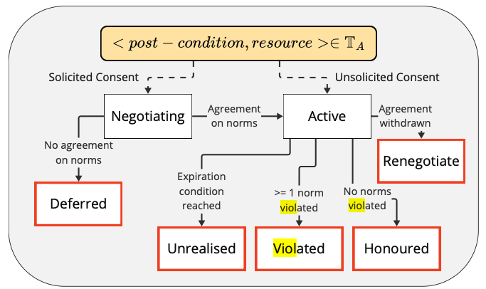

# Requirements from Aperion's Paper

## Agents
- Each agent owns only 1 resource in the paper. We abandon this assumption.
- Goals of the agents are represented as propositional atoms in $\mathbb{G}$. For us, subgoals are represented likewise.
- An action: $t = <p, r>, where p \subseteq \Omega$ is the non-empty post condition (changes it makes in the state) of t and r is the affected resources.

## Norms
- There is a set of norms $\mathbb{L}$ in the STS, that are active even before any execution begins. (e.g. Prohibitions that keep agents from using others' resources.)
- Some norms might conflict. For such cases, a norm recency based priority ordering is used.
- $AU = <G, R, c, <p, r>>$, where $c = c_{det} \land \lnot c_{exp}$
- $ CO = <R, G, p, g_R>$, where $g_R$ is the stated goal of $R$ and $p$ is the postcondition of the action $t$ in $AU$. 
- An AU is activated when $c_{det}$ becomes true.
- An AU expires if $c_{exp}$ becomes true and the authorized action was never executed. This transitions the CI into UNREALIZED state.
- An AU is violated in a state $\mathbb{S}$ of the STS if  $R$ executes an action $<p, r>$ eventhough $c_{det}$ in $c$ remains false or after $c_{exp}$ becomaes true.
- A CO is violated when the consequent $g_R$ does not hold after the antecedenet $p$ holds. (!!! This is problematic. We need time in between antecedent and consequent)
- Prohibition: $Pr(A, t) = A \in \mathbb{A}, t=<p, r> \in \mathbb{T}_A, r \notin \mathbb{R}_A$ (!!! We will include both agents in this abstraction.)

## Consent
- A consent instance must be constrained to a specific agent, action, goal, and norms.
- Unless permitted by the norms in $L$, an agent can perform an action only if it has consent for it.
- $CI = <G, R, c, <p, r>>$ where $\mathbb{G}$ is the consent giver, $\mathbb{R}$ is the consent receiver, $c = c_{det} \land \lnot c_{exp}$, $<p, r>$ is the action $t$.
- Consent must be feasible. The agent need to be able to perform the stated goal if it acquires consent. (e.g., if G is lending their car, the car should not be broken.)
- $R$ requires consent from $G$ to use $r \in \mathbb{R}_G$
- $G$ and $R$ can negotiate to agree upon the details of consent. When negotiation begins, a consent instance is initialized. A negotiation ends when $G$ and $R$ come to an agreement about the norms in $\mathbb{N}$
- Agreed upon norms = $\mathbb{N} = \{AU, CO\} \cup \mathbb{N'}$, where $\mathbb{N'}$ includes any other norms that might have been invoked during the negotiation. E.g., Prohibitions to use $r$ for a goal different than $g_R$ Hence an agreement results in at least 1 CO and 1 AU (unsolicited consent is an exception to this rule).

- Consent Life-Cycle and States:

- An consent instance can be terminated by an agent (i.e. when the agent requests some changes in the agreed upon norms), then CI transitions into RENEGOTIATION state.
- a CI is violated if any of the norms in $\mathbb{N}$ are violated.
- a CI is honored if all of the norms in $\mathbb{N}$ are fulfilled.
- an agent should be able to check if it needs consent for the planned action. (We don't implement this as an explicit function. Our agents start negotiating for consent if the need a resource that is available to use from another agent. But we might need it if we implement pre-existing norms in L.)
- $g_R$ might change during negotiation.

- Functions presented in the paper:
1. hasConsent(R, G, L, t)
2. solicitConsent ~ our requestConsentFunction
3. negotiate(): 
4. getConsentGiver()
5. determineStatedGoal()
6. update_L()
7. consentBasedReasoning

Question:
Usecase 4 in the paper: isn't that an impossible consent?

### Unsolicited Consent

- Unsolicited consents do not invoke COs, only AUs.
- $AU = <G, R, c, t>$

# consent_abs

Naming Convention for atoms:
<agent_id>-<goal_name>-<subgoal_name>-<resource_id>-<valid_tick_count>

What kind atoms will there be?
- agentX-make_rice---: AgentX made rice: TO BE IMPLEMENTED AFTER GOAL COMPLETION
- agentx--use_stove--: Agent x has acquired a stove, so we need to update the state about this
- agentX-make_rice---20: AgentX will make rice in 20 ticks. (Turns FALSE after 20 ticks passes from its creation): TO BE IMPLEMENTED AFTER NEGOTIATION.
- agentX-make_rice--resourceY-: AgentX made rice by using resourceY: TO BE IMPLEMENTED AFTER GOAL COMPLETION
- EXP_agentX--use_butter-10-20: Expiration conditions: Becomes true if agentX hasnt made rice between steps 10 and 20. An agent can give consent until they will need the resource for example. This can be a key part of negotiaion.

- Do I need soverignty atoms like: AgentX--resourceY-: AgentX holds resourceY. I don't think so